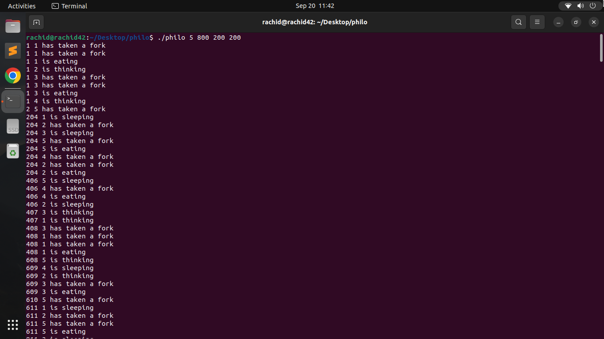
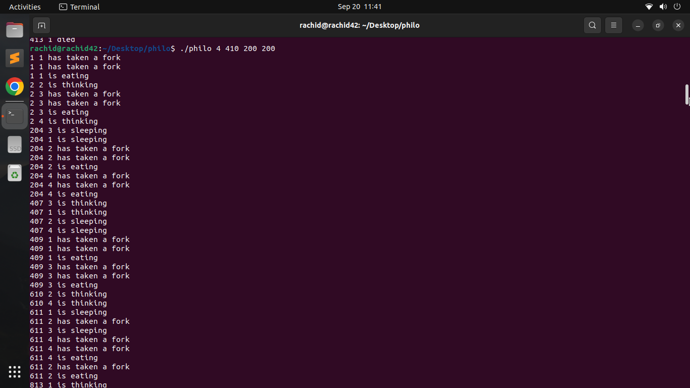
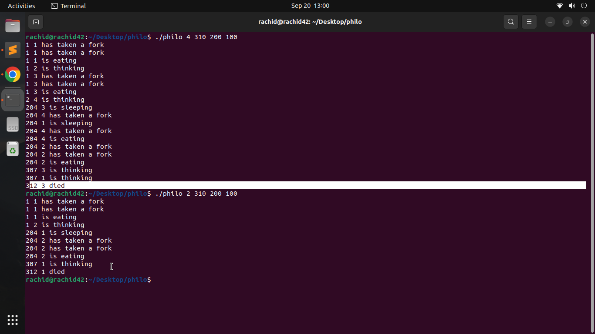

<h1 align="center">
	PHILOSOPHERS 42
</h1>

<h3 align="center">
	<a href="#summary">Summary</a>
	<span> · </span>
	<a href="#usage">Usage</a>
	<span> · </span>
	<a href="#tester">Tester</a>
	<span> · </span>
	<a href="#resources">Resources</a>
	<span> · </span>
	<a href="#tools">Tools</a>
	<span> · </span>
	<a href="#helgrind-tutorial">Helgrind tutor</a>
	<span> · </span>
	<a href="#optimization">Optimization</a>
</h3>

##  Summary

Solution of classical synchronization problem about
[dining philosophers](https://en.wikipedia.org/wiki/Dining_philosophers_problem)
where each philosopher is a thread and mutexes are used to prevent deadlocks.

* ***[detailed subject](doc/subject.md)***

External functions: `printf`, `malloc`, `free`, `write`, `usleep`, `gettimeofday`, `pthread_create`, `pthread_join`, `pthread_mutex_init`, `pthread_mutex_destroy`, `pthread_mutex_lock`, `pthread_mutex_unlock`

Code written in accordance with **42 C** coding style,  **ANSI C89** compliant and entirely **documented with docstrings**.

##  Usage

Run `make` in the root of the projet and launch as follows:

    ./philo <philo_nb> <time_die> <time_eat> <time_slp> [ <must_eat> ]

- `philo_nb` -- the number of philosophers and forks.
- `time_die` -- A philosopher dies if he doesn't start to eat `time_die` ms
  after **the beginning of his last meal** (or the simulation).
- `time_eat` -- The time it takes for a philosopher to eat.
- `time_slp` -- The time it takes for a philosopher to sleep.
- `must_eat` -- (optional) simulation stops if all philosophers ate at least
  such amount of times.

- IF NOT `must_eat` THEN simulation stops at first death.
- IF `philo_nb > 200` OR `time_to_* < 60` ms THEN undefined behavior.

Example of a dinner that should never stop:

    ./philo 4 410 200 200
            +-|---|---|-- philo_nb
              +---|---|-- time_die
                  +---|-- time_eat
                      +-- time_slp

➡️ **Minimum `time_die` for EVEN `philo_nb`**:

```
	2 x time_eat + e
```

➡️ **Minimum `time_die` for ODD `philo_nb`**:

```
if time_eat >= time_slp

	3 * time_eat + e

if time_eat < time_slp

	time_eat + time_slp + e
```

*Where `e` is a margin of error starting from +1ms.*

***Makefile rules***

- `make` -- compiles philo.
- `make clean` -- deletes object files.
- `make fclean` -- deletes object files and philo.
- `make re` -- `fclean` + `make`.

##  Tester

The tester will run specified tests 5 times:
1. with helgrind
2. with valgrind
3. with sanitizer=address
4. with sanitizer=thread
5. with nothing

The first test will run all the tests from the evaluation scripts 5 times:
`make test_eval`

The second test will run the test of your choice 5 times:
`make test_custom p="<philosophers_arguments>"`

##  Resources

- **[CodeVault](https://www.youtube.com/playlist?list=PLfqABt5AS4FmuQf70psXrsMLEDQXNkLq2)**<br>

- **[Concurrent programming](https://begriffs.com/posts/2020-03-23-concurrent-programming.html)**<br>

##  Tools

- **[philosophers-visualizer](https://nafuka11.github.io/philosophers-visualizer/)**

- **[ft_mallocator](https://github.com/tmatis/ft_mallocator)**

- **valgrind**: `valgrind -q --leak-check=yes --show-leak-kinds=all`

- **sanitizer**: `-fsanitize=thread`

- **valgrind**: `valgrind -q --tool=helgrind`

##  Helgrind tutorial

How to track and fix a data race?

1. **Output example**

`DATA RACE` and `CONFLICTS` are the main terms that interest us `1>` in the
output of helgrind, `utils.c:35` and `utils.c:40` the location of the two
variables that he indicates to us as being in conflict and that we must protect
with a mutex `2>`.

    1> ==174034== Possible DATA RACE during write of size 1 at 0x4A44062 by thread #1
       ==174034== Locks held: none
    2> ==174034==    at 0x40262C: ft_died (simulator_utils.c:47)
       ==174034==    by 0x401C81: ft_monitor (simulator.c:93)
       ==174034==    by 0x401B14: ft_simulator (simulator.c:132)
       ==174034==    by 0x4012B8: main (main.c:79)
       ==174034==
    1> ==174034== This CONFLICTS with a previous read of size 1 by thread #4
       ==174034== Locks held: 3, at addresses 0x4A44128 0x4A44250 0x4A442A0
    2> ==174034==    at 0x40240C: ft_msleep (time_utils.c:77)
       ==174034==    by 0x402093: ft_eating (simulation.c:103)
       ==174034==    by 0x401F0A: ft_simulation (simulation.c:136)
       ==174034==    by 0x483F876: mythread_wrapper (hg_intercepts.c:387)
       ==174034==    by 0x4862EA6: start_thread (pthread_create.c:477)
       ==174034==    by 0x4979DEE: clone (clone.S:95)
       ==174034==  Address 0x4a44062 is 34 bytes inside a block of size 48 alloc'd
       ==174034==    at 0x48397CF: malloc (vg_replace_malloc.c:307)
       ==174034==    by 0x401930: ft_init (init.c:114)
       ==174034==    by 0x401289: main (main.c:77)
       ==174034==  Block was alloc'd by thread #1

2. **Fix example**<br>

At `simulator_utils.c:47` we have:

    data->died = true;

That can be protected like this:

    pthread_mutex_lock (&data->mutex[DIED]);
    data->died = true;
    pthread_mutex_unlock (&data->mutex[DIED]);

At `time_utils.c:47` we have:

    if (philo->data->died)
        return ;

That can be protected like this:

    pthread_mutex_lock (&philo->data->mutex[DIED]);
    if (philo->data->died)
        return ((void)pthread_mutex_unlock (&philo->data->mutex[DIED]));
    pthread_mutex_unlock (&philo->data->mutex[DIED]);

Or like this:

    int died;
    pthread_mutex_lock (&philo->data->mutex[DIED]);
    died = philo->data->died;
    pthread_mutex_unlock (&philo->data->mutex[DIED]);
    if (died)
       return ;

##  Linux OS Tests




##  Optimization

1. **Locking granularity**:

"The **granularity of a lock is how much data it protects**. A lock with coarse
granularity will protect a large amount of data, and a lock with fine
granularity will protect a small amount of data.

Although it is tempting **to place locks at the finest level of granularity**
possible, it **is not usually the best strategy**. Having many locks with fine
granularity tends to introduce overhead. The overhead comes from the increased
amount of memory needed to hold these locks and the decreased likelihood that
the locks will be cache resident when they are needed.

However, having few locks usually results in those locks becoming contended by
multiple threads, which limits the scaling of the application. Therefore, the
granularity of the locks is usually some kind of **trade-off** between a few
contended locks and many uncontended locks. The appropriate balancing point will
**depend on the number of threads**, so it may actually change if the application
is run with different workloads of with different numbers of threads. Hence, it
is important to test an application with both representative workloads and on a
representative system with sufficient virtual CPUs.

The key to picking the **optimal locking strategy** is often a good grasp of the
**theoretical performance** of the application, in comparison with the actual
profile of the application. It is also important to examine the actual scaling
of the application as the number of threads increase."

*Source: Multicore Application Programming by Darryl Gove*

2. **[Performance Analysis with Callgrind and Cachegrind](https://www.vi-hps.org/cms/upload/material/tw10/vi-hps-tw10-KCachegrind.pdf)**

